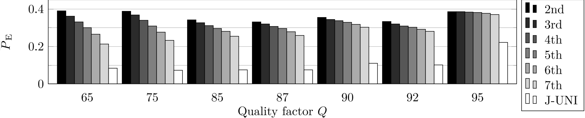
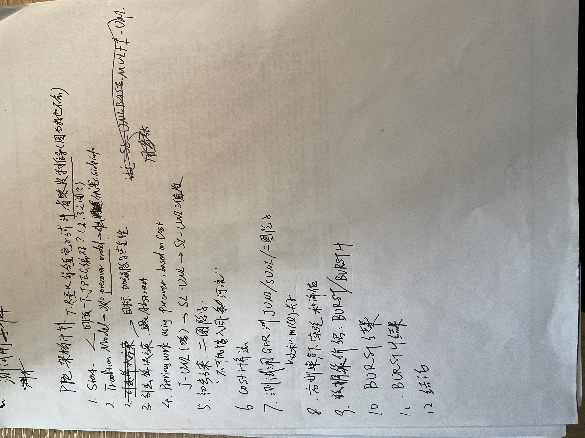

# 信息隐藏课程实验报告

# Outlines

1. 背景
2. 方法介绍
3. 效果描述
4. 评价和思考

# 背景

传统的隐写-检测对抗模型通常由三个角色组成，发送者Alice，接收者Bob和检查者Warden，其中Warden的目标是检查传递的信息是否可能被嵌入秘密信息。一直以来Alice可以通过其持有的优势，即拥有未经压缩的原图，称为precover。Precover中包含了许多信息，例如更多的像素点等等，Alice可以将其作为side-information辅助增强隐写的安全性。原先这类解决方案有Vojtech Holub等人提出的将未舍入的DCT系数作为side-information和Fridrich提出的将true color信息在将原图转换为调色板图片时嵌入。之后的工作考虑使用多张相同地点时间拍摄的照片作为side-information辅助嵌入。

现代的许多设备，例如手机和一些低端的相机，出于节省空间考虑，会只保留JPEG，从而Alice无法接触到precover的一些优势信息（例如未舍入的DCT系数）。之后提出了使用多张相同但有一定差异的照片作为side-info辅助提高隐写的安全性，但是这种方法在具有一定安全性的同时也具有一定的问题：

1. 建模困难。主图片（被嵌入的图片）和其他图片之间的差异（即噪声）难以建模。通常认为噪声有两个来源：采集机器的固定噪声和环境的随机噪声。随机噪声难以有一个合适的模型描述。
2. 效率较低。为对噪声进行相对合适的建模，需要获取相当多的相同曝光。传统的方式采用使用扫描仪对同一张图片进行扫描的方式进行采样。这种方式将会消耗大量的时间和人力成本。

相对于之前的方法，这种方法在现代的图片传递模型下具有一定的优势。本文在这类工作的基础上提出了一种改进方式，使用多张照片进行嵌入的同时规避了之前方案的弱点和问题。在实际测试用例的测试下，证明具有较强的安全性，同时性能更加优异。

## Preliminaries

本文使用了下面的符号系统：

- 将图像分为若干块8*8的块，每块的行列编号分别为$u,v$。
- $z_{i,j}^{(u,v)}$为第$u,v$块的第$i,j$个像素的灰阶值
- $d_{i,j}^{(u,v)}$为DCT系数
- $q_{i,j}^{(u,v)}$为根据质量系数$q$确定的量化矩阵参数
- $c_{i,j}=\frac{d_{i,j}^{(u,v)}}{q_{i,j}^{(u,v)}}$，$x_{i,j}=[c_{i,j}]$

# 方法介绍

## 基于代价指导的隐写方式

基于代价的隐写方式的指导思想是建立一个量化的代价模型（这里代价指的是隐写对于画面的影响程度），通过使得代价最小指导隐写的方式。目前比较主流的方式是基于修改量化DCT系数的代价建模，即设对于DCT系数，修改$+1$的代价是$\rho_{i,j}^{(u,v)}(1)$，修改$-1$的代价是$\rho_{i,j}^{(u,v)}(-1)$。而总代价计算为$D(x,y)=\sum\rho_{i,j}(y_{i,j}-x_{i,j})$，对于比较流行的嵌入方式，即只修改DCT系数+1或者-1，有$y_{i,j}=x_{i,j}\pm1$。当$D(x,y)$取得最小值时，嵌入对于视觉的影响最小，认为安全性最高。

基于这种思想的方案有*J2-Uniward*和*SI-Uniward*。J2-Uniward使用的是对称代价，即$\rho_{i,j}^{(u,v)}(1)=\rho_{i,j}^{(u,v)}(-1)$。如果需要禁止对于某像素的嵌入，则可以将代价设置为一个极大的值，使得不会在该像素进行嵌入。这种做法被称为*wet cost*。

SI-Uniward通过调整JPEG的四舍五入方式控制嵌入。这种嵌入方式通过使用未舍入的DCT系数作为side-info。具体地，SI-Uniward使用未舍入的DCT系数指导计算代价。设$e_{i,j}=c_{i,j}-x_{i,j}\in(-0.5,+0.5)$，即进行舍入改变的值。当$|e_{i,j}|$接近0.5时，轻微的扰动就会造成舍入后的值的变化。此时代价应给非常小。例如：如果要将值4.4的舍入后值改为5，只需要将4.4+0.1，代价等价于0.1；而如果是4.1，代价则等价于0.4 。

基于这种思想，SI-Uniward做出如下代价的设定：
$$
\rho_{i,j}^{(u,v)}(1)=(1-2|e_{i,j}|)\rho^J_{i,j}\\
\rho_{i,j}^{(u,v)}(-1)=\infty=C_{wet}
$$
以这种方式指导嵌入，可以得到代价相对较小的方案，从而减少嵌入前后的视觉差异提高安全性。但这两种方式在无法接触到原图未经舍入的DCT系数时并不适用。

## 使用多张图片的隐写方式

### 使用两张图片的隐写方式

本文提出的隐写方法（J2-Uniward）基于上文提到的J-Uniward。通过第二张图片提供的侧信息指导第一章图片进行隐写。记第一张图片的像素灰度值为$x_{i,j}^1$，第二张为$x_{i,j}^2$。

简单的步骤如下：

1.   基于J-Uniward计算每个像素的代价
2.   对于每个像素：
     1.   如果$x_{i,j}^1=x_{i,j}^2$，不进行修改
     2.   如果$x_{i,j}^1\not=x_{i,j}^2$，设代价$\rho_{i,j}(s_{(i,j)})=m(Q)\times\rho^0_{i,j}(s_{i,j})$
3.   使用一般的基于代价的嵌入方式嵌入

其中，函数$m(\cdot)$依赖经验决定，$Q$为JPEG压缩过程中的质量系数。

### 使用多张图片的隐写方式

设图片的像素灰度值分别为$x_{i,j}^1,x_{i,j}^2,x_{i,j}^3,\dots,x_{i,j}^k$，则在有噪声的情况下估计图片的真实像素值（排除噪声的印象）的方法为$\hat{r}_{i,j}={\sum_{m=1}^k x_{i,j}^m} /k$。尽管通过多张采样可以获取更多的信息，但在多张图片引入计算的同时噪音误差也会累计。同时对于计算$e_{i,j}=\hat{r}_{i,j}-x^1_{i,j}$，也可能出现在预计的范围$(-0.5,0.5)$之外的情况，因此，文章提出多张同时参与嵌入的最佳方案是选择两张差异最小的照片进行嵌入，使用上述的两张图片的嵌入方式。

# 效果测试和描述

## 测试数据集

为测试提出的新方法的效果，文章使用了三种数据集进行测试，分别是使用高斯噪声模拟一般噪声的数据集、使用三脚架实地拍摄的数据集BURSTBase和使用手持相机拍摄的数据集BURSTBaseH。其中：

- BURSTBase：
  - 采集了133组，每组7张图片
  - 预处理后分割为9310张512*512的灰阶图片
- BURSTBaseH：
  - 采集了154组，每组7~13张图片
  - 预处理后分割为17480张512*512的灰阶图片

## 测试方法、比较对象和测试指标

测试阶段采用MSE衡量图片间的差异，MSE即均方误差。本文将提出的方法（称作J2-Uniward）和J-Uniward、SI-Uniward在上述三种测试集上比较，使用一种简单的线性分类器GFR作为检测器对三种方法嵌入的载体进行检测。这种检测器对J-Uniward已经被证明有较好的效果。

为量化检测效果从而比较三种嵌入方式的安全性能，文章以指标$P_E$衡量嵌入方式的安全性能。定义如下：
$$
P_E=(P_{MD}+P_{FA})/2
$$
即误报率=(假阳性+假阴性)/2。一般地，$P_E$越高说明越能抵抗GFR的检测，安全性能越好。

## 使用随机高斯噪声的测试

在该测试中，一张无损图片被人为添加两种高斯噪声$z_{i,j} ^1,z_{i,j}^2$。对于每一个非0的AC DCT系数，嵌入0.4比特信息。测试得出平均安全性指标$\bar{P_E}$和压缩质量因数$Q$的关系如下图所示：

根据以上的结果可以得出下面的结论：

1. 本文提出的J2-Uniward在高斯噪声下的表现显著优于J-Uniward
2. 在质量系数$Q$较高（>80）时J2-Uniward拥有比Si-Uniward更强的安全性。

分析出现这种结果的原因：第二张图片提供的侧信息$x_{i,j}^2$告知了Alice关于计算代价的信息，这种方法取代了简单计算$e_{i,j}=c_{i,j}-x_{i,j}$的计算方式。当且仅当$x_{i,j}^1\not =x_{i,j}^2$才能发挥作用。而当$Q$的值越大，即JPEG的质量越高，这种情况发生的概率才越大。即JPEG的压缩过程会损失信息，这些损失的信息使得嵌入的安全性变低。

## 使用真实数据集的测试

### BURSTBase

#### 两张图片的测试

BURSTBase是使用三脚架实地拍摄的图片数据集。在该数据集下使用三种不同方法的结果如下：

1. J2-Uniward仍然具有比J-Uniward更强的安全性
2. SI-Uniward的安全性仍然普遍高于J2-Uniward，只有Q=95时出现反转
3. 当Q一致时，单位非0DCT系数平均嵌入的比特数越少，安全性越高。

#### 多张图片的测试

将同一系列的图片按照和第一张图片的相似程度（通过MSE计算）降序排列，逐个使用编号为2~7的图片作为侧信息进行嵌入，测试得到的安全性指标如下：

1. 图片间差异越大，安全性能越弱
2. $Q$越大，差异带来的安全性能影响越小

#### 采用比例的测试

设$\gamma\in (0,1])$，使用数据集内前$\gamma$相似的图片参与嵌入，在设定$m(Q)=0.01,Q=75$的条件下进行测试，得出下图的结果：

上下图分别是每非0DCT系数嵌入0.2/0.4比特信息的实验结果。可以得出当拒绝更多相似程度低的图片时，嵌入效果越好。

# 方案评价和结论

文章提出的方案在模拟和现实测试中安全性指标均大幅超过J-Uniward，接近了SI-Uniward能提供的安全性，并且并且对于较大的质量参数，两个 JPEG 比一个未压缩的图像更好地告知发送者首选的嵌入变化方向。对于实地拍摄的数据集，由于图片之间的随机差异明显较大，使用多张图片进行隐写的经验安全性明显下降。然而，在这种情况下仍然可以使用筛选差异较小的图片进行嵌入获得较高的安全性。

这篇文章是我在研究生阶段第一篇精读的文章。从这篇文章开始学术之路，不得不说是一种天意。阅读的过程自然是痛苦的，好在本科阶段在马老师的课上学习的十分认真，在阅读的过程中通过查阅资料，逐渐理解了整篇文章。在阅读的过程中，通过参考学习，逐渐总结出了自己的一套文献阅读方法论和工具箱，并且出色完成了ppt的制作和pre的准备过程。我想这就是这篇文章最大的收获了。同时感谢老师的讲授和指导。

# Appendix

课程报告，pre，实验代码和报告均开源于[iridium-soda/Steg_Experiment_Master_HUST: Information Hiding and Digital Watermarking Experiment of Master, HUST, Cyber Security, 2022 (github.com)](https://github.com/iridium-soda/Steg_Experiment_Master_HUST)

附部分手写笔记：

